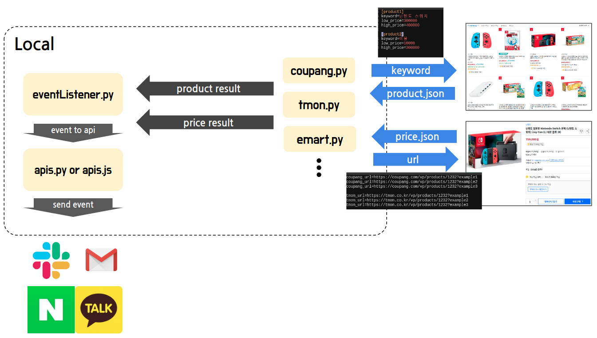

# Observer_KR

닌텐도 스위치를 사기 위해 시작했던 프로젝트이지만 당근마켓에서 이미 구했으므로 기존 구현에서 더욱 확장해서 사고싶은 물건을 원하는 가격대에 구매할 수 있게 감시해주는 

## Idea

- 키워드와 금액대로 내가 원하는 물건을 어느 정도 특정지을 수 있지 않을까
  - ex ) 닌텐도 스위치, 340,000 ~ 380,000 원
  - 원하는 물건이 선택이 안 될 수도 있음.
- 사용자가 직접 입력한 URL을 감시하면서 사용자에게 금액 변화를 KakaoTalk, SMS, Email 을 통해 전송
  - 원하는 물건은 선택 되나 금액 변화( 할인 )가 없을 수도 있음. # 사용자로 하여금 의심하게 만듬.
- 구매또한 가능할 것 같아서 집어넣을려 했으나 원하는 물건을 특정짓는게 완벽히 되지 않기 때문에 혹여나 어떠한 불상사가 일어날 수도 있으니 제한.

## Architecture

언제든지 수정 될 수 있습니다.  ( 2020.06.14 )

## 현재 상황

원하는 기능은 구현을 했지만.. 잘 짠 코드라고 생각하지 않았습니다. 문제점 파악 후 현재는 Python 클린 코드 책을 산 후 공부중에 있습니다.
그리고 현실적으로 내가 지금 당장 해야 되는 것들을 공부하고 있습니다.
